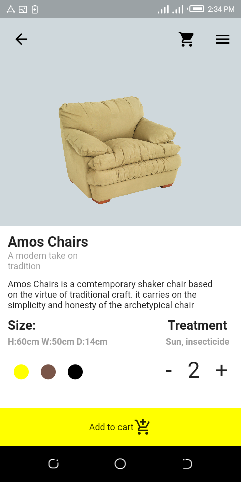
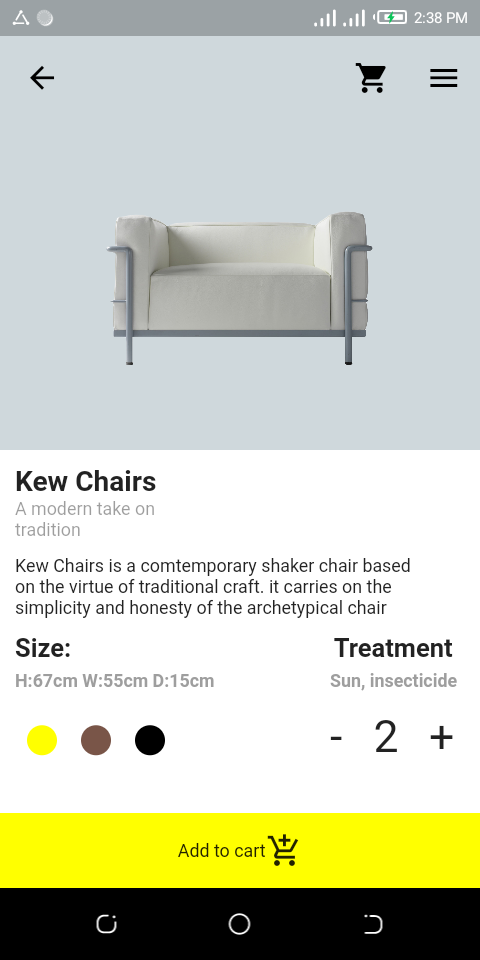
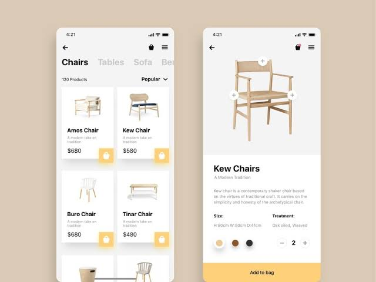

Furniture app built with Flutter 
Inspiration from Dribble
I couldn't get the real assets but I replaced them with the available one's
changes has been made....give a star ⭐ if you like what you see

## 💻 Requirements

- Any Operating System (ie. MacOS X, Linux, Windows)
- Any IDE with Flutter SDK installed (ie. IntelliJ, Android Studio, VSCode etc)
- A little knowledge of Dart and Flutter

## ✨ Features
- [x] ......

## 📸 ScreenShots

<!--  -->

 

## 😋 Dribble UI

## 🤓 Author(s)

**Flutter BoyFriend**
